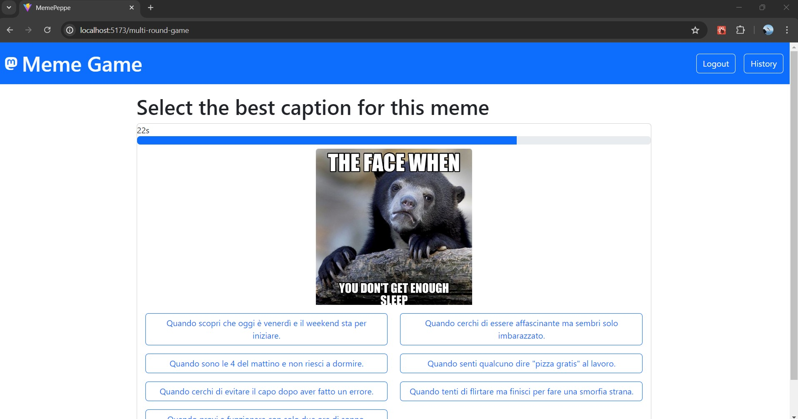
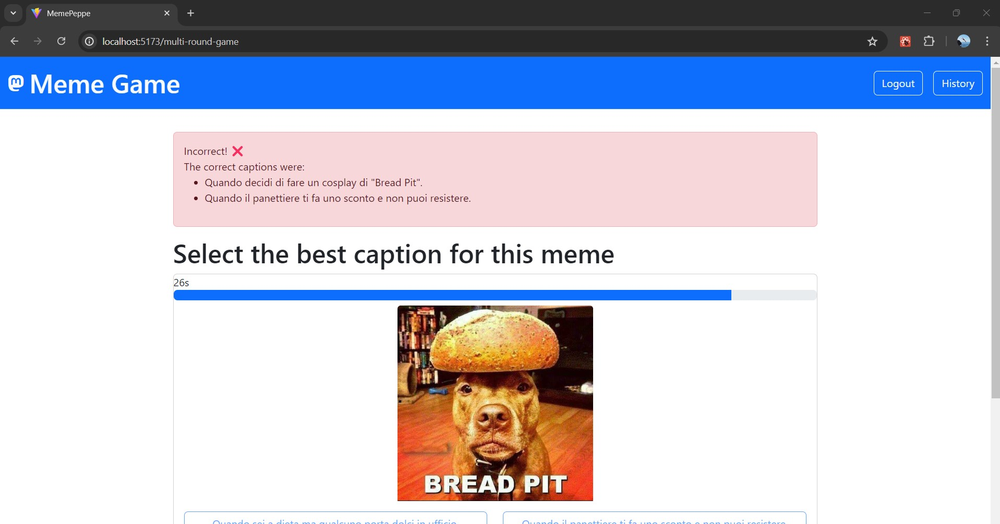

# Exam #N1: "Gioco dei Meme"
## Student: s329535 ARBORE GIUSEPPE

## React Client Application Routes

- Route `/`: Home page that introduces the game and provides navigation options.
- Route `/single-round-game`: The main game interface where users not logged in can play the single round.
- Route `/multi-round-game`: The main game interface where users logged in can play the meme game.
- Route `/game-over`: Displays the results of the game after completion.
- Route `/login`: User login page for authentication.
- Route `/profile`: User profile page where the player can see their game history and scores.
- Route `/game/:id`: Page where the user logged-in can see his game whid id id

## API Server

### User Authentication APIs
- **POST `/api/sessions`**
  - **Request Body:**
    - `username`: string
    - `password`: string
  - **Response Body:**
    - `id`: integer
    - `username`: string
    - other user details

- **GET `/api/sessions/current`**
  - **Request Parameters:** None
  - **Response Body:**
    - `id`: integer
    - `username`: string
    - other user details

- **DELETE `/api/sessions/current`**
  - **Request Parameters:** None
  - **Response Body:** Empty

### Gameplay APIs
- **POST `/api/check-captions`**
  - **Request Body:**
    - `memeId`: integer
    - `captionId`: integer
  - **Response Body:**
    - `isCorrect`: boolean

- **GET `/api/get-correct-captions/:memeId`**
  - **Request Parameters:**
    - `memeId`: integer
  - **Response Body:**
    - List of correct captions for the given memeId

- **GET `/api/memes/:memeId`**
  - **Request Parameters:**
    - `memeId`: integer
  - **Response Body:**
    - `id`: integer
    - `imageUrl`: string
    - other meme details

- **GET `/api/single-round-meme`**
  - **Request Parameters:** None
  - **Response Body:**
    - `meme`: meme object
    - `captions`: list of captions

- **GET `/api/multi-round-meme`**
  - **Request Parameters:** None
  - **Response Body:**
    - List of memes and their respective captions for multiple rounds

- **POST `/api/games`**
  - **Request Body:**
    - `userId`: integer
    - `rounds`: array of round objects
    - `finalPoints`: integer
  - **Response Body:**
    - Created game object

### User Game History APIs
- **GET `/api/games/user/:userId`**
  - **Request Parameters:**
    - `userId`: integer
  - **Response Body:**
    - List of games played by the user

- **GET `/api/games/:gameId/rounds`**
  - **Request Parameters:**
    - `gameId`: integer
  - **Response Body:**
    - List of rounds for the given gameId

## Database Tables

- **Table `users`**
  - `id`: integer, primary key, unique
  - `email`: string, not null
  - `name`: string, not null
  - `hash`: string, hashed, not null
  - `salt`: string, not null

- **Table `meme`**
  - `id`: integer, primary key
  - `immagine`: string, not null

- **Table `didascalie`**
  - `id`: integer, primary key
  - `text`: string, not null

  - **Table `didascalie_meme`**
  - `id_meme`: integer, primary key
  - `id_didascalia`: string, not null

- **Table `gameplay`**
  - `id_gameplay`: integer, primary key
  - `id_utente`: integer, foreign key
  - `punteggio`: datetime
  - `id_round1`: integer, foreign key
  - `id_round2`: integer, foreign key
  - `id_round3`: integer, foreign key
  - `date`: string

- **Table `round`**
  - `id_round`: integer, primary key
  - `id_meme`: integer, foreign key
  - `punteggio`: integer, foreign key

## Main React Components

- `MultiRoundGame` (in `MultiroundGame.jsx`): Main component for the meme game, handles game logic and user interactions.
- `AuthComponents` (in `AuthComponent.jsx`): Component for user login, handles authentication.
- `History` (in `History.jsx`): Displays user profile information and game history.
- `GameOver`: Displays the results of the game after completion.
- `SingleGameHistory` (in `MemSingleGameHistoryList.jsx`): Displays a list of rounds for the game.

## Screenshot

## Users Credentials

- email: `peppe@polito.it`, password: `password`
- email: `mario@polito.it`, password: `password`
